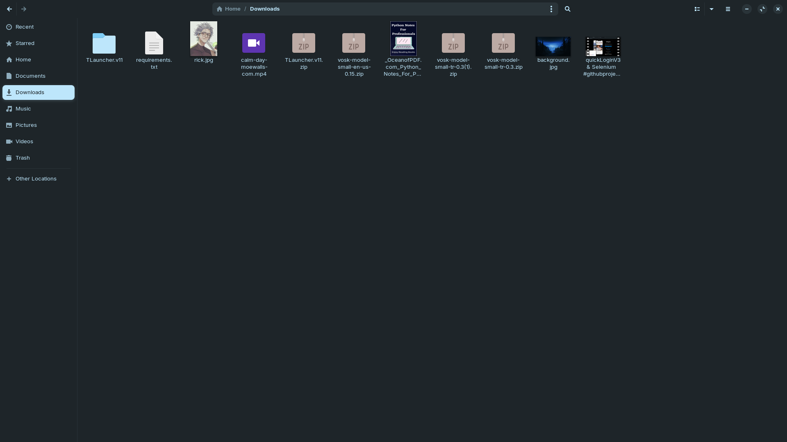
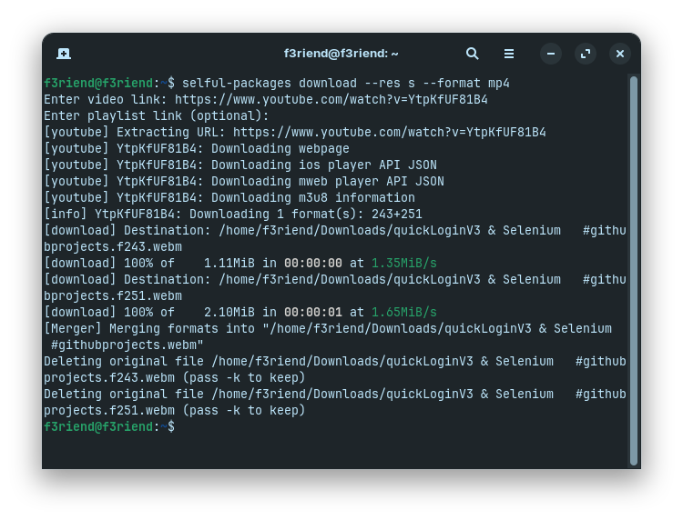
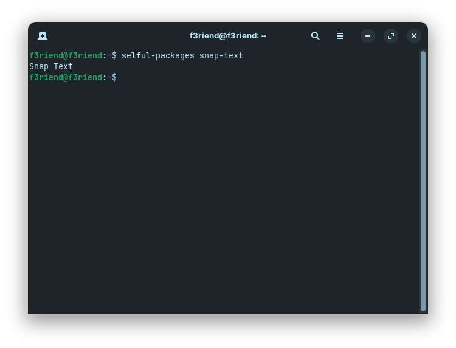

<div align="center">
  <table>
    <tr>
      <td colspan="2" align="center">
        
      </td>
    </tr>
    <tr>
      <td align="center">
        
      </td>
      <td align="center">
        
      </td>
    </tr>
  </table>
</div>


# selful-packages


#### Cli ( Command Line Interface ) 

**The reason I developed it** is that I use linux and I like to use the terminal and keyboard shortcuts, so I thought why not integrate my own custom packages into the terminal, and with the keyboard shortcuts I can link the commands I want and run them automatically.

**Upload to the system**
```bash
sudo pip3 install .
```

This command installs the python package on the system and makes it accessible from anywhere.

<hr><br>

```bash
selful-packages snap-text
```


**The output will be like this:** Snap Text

For now, I haven't added too many commands because I haven't thought of many ideas.
